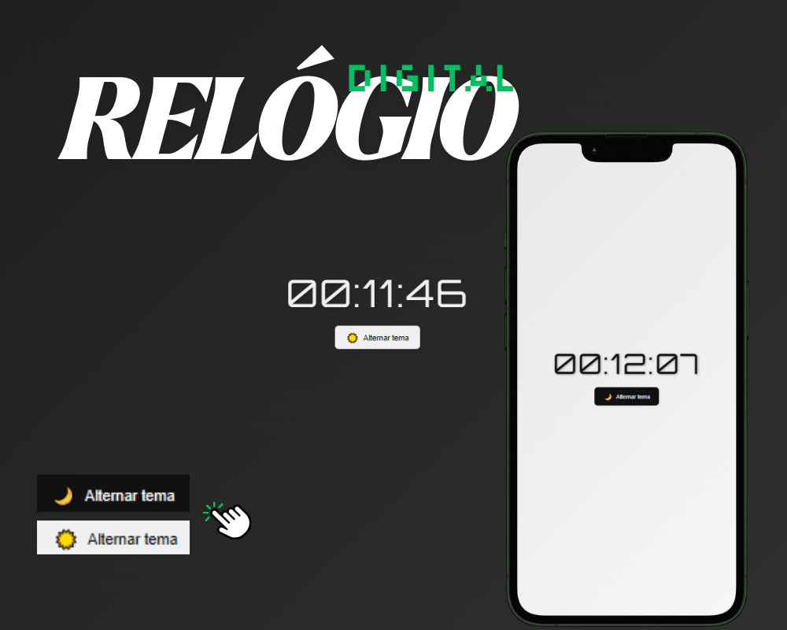

# Relógio Digital

Projeto simples de relógio digital com alternância entre tema claro e escuro, feito em JavaScript.

Este foi um desafio pessoal para testar meus conhecimentos em manipulação de DOM e eventos no JavaScript. A ideia surgiu ao querer um relógio que pudesse trocar o tema dia/noite diretamente na tela, sem precisar recarregar.

---

## Tecnologias

- HTML
- CSS
- JavaScript

---

## Como usar

1. Abra o arquivo `index.html` no navegador.
2. Clique no botão "Alternar tema" para mudar entre o modo claro e o modo escuro.

---

## Imagem do projeto

---

Feito com ❤ para aprimorar minhas habilidades em JavaScript e manipulação de temas.
